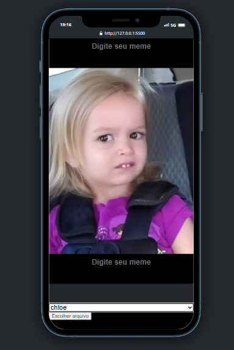
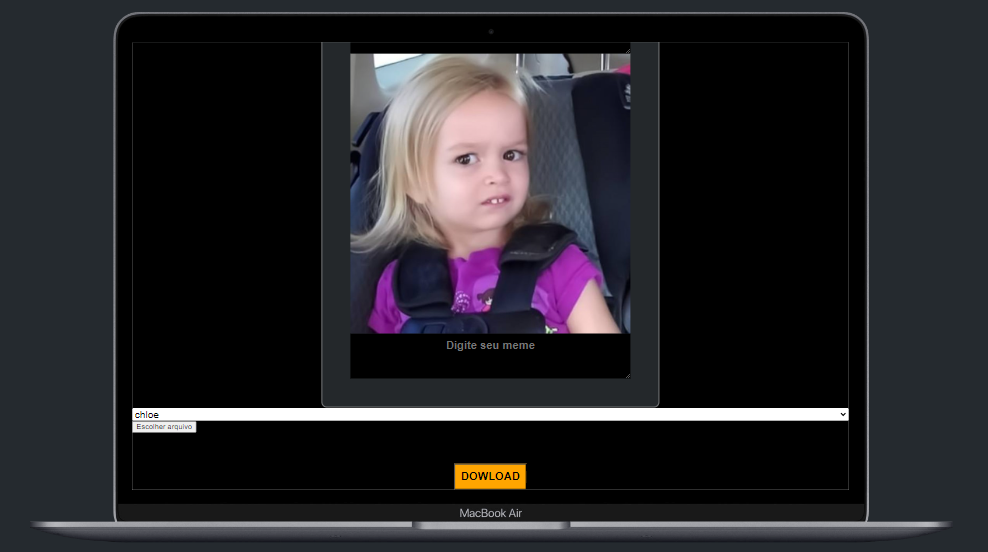

# Big Game Survey 
[](https://github.com/GuilhermeHenrii/gerador-de-memes/blob/main/LICENSE)

# Sobre o projeto

Nesse pequeno projeto, guiado pelo pessla do Dio, criei um gerador de memes usando apenas javascript puro.

Usei os métodos de FileReader para obter o arquivo enviado. Criei também métodos para criar uma espécie de galeria de imagens já "pré-setadas" para o usuário poder usar.

O usuário também tem a opção de enviar sua própria imagem e escrever legendas, na parte superior ou inferior da imagem.

Por último, implementei um botão para o usuário pode baixar a imagem do meme que ele criou. Nesse botão eu utilizei html2canvas, que é baseado no DOM para fazer "capturas de tela".

## Layout mobile


## Layout web


# Tecnologias utilizadas
- HTML / CSS / JS 
- html2canvas

# Como executar o projeto
Pré-requisitos: vsCode

```bash
# clonar repositório
git clone https://github.com/GuilhermeHenrii/gerador-de-memes.git

# entrar na pasta do projeto front end web
cd gerador-de-memes

# Para executar o projeto execute o live server no .html raiz
```

# Autor

Guilherme Henrique da Silva Lopes

https://www.linkedin.com/in/guilherme-henrique-7aab6b229/
